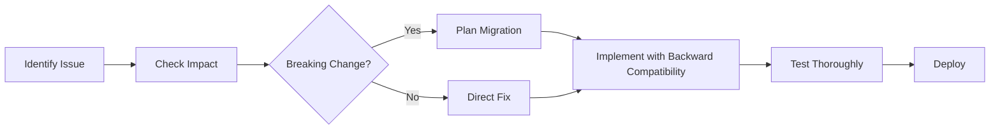

# Dashboard Refactoring Principles

## 🎯 Core Principles

### 1. **Maintain Functionality First**
- **절대 기능을 깨뜨리지 않는다**
- 모든 변경은 기존 기능이 100% 동작하는 상태를 유지해야 함
- UI/UX는 개선할 수 있지만, 사용자 경험의 흐름은 유지

### 2. **Type Safety Over String Literals**
- **모든 상수는 Enum으로**
  ```typescript
  // ❌ Bad
  if (factory.type === '제조') { ... }
  
  // ✅ Good  
  if (factory.type === FactoryType.MANUFACTURING) { ... }
  ```
- ID 기반 비교를 우선시 (문자열 비교 최소화)
- 타입 안전성이 런타임 오류를 방지

### 3. **Centralized Consistency**
- **중앙 집중식 관리**
  - `/src/types/enums.ts` - 모든 Enum 정의
  - `/src/hooks/useModalFormValidation.ts` - 모달 validation 로직
  - `/src/components/common/BaseModal.css` - 모달 스타일
- **한 곳에서 관리하면 일관성이 자동으로 따라온다**

### 4. **Progressive Enhancement**
- **점진적 개선**
  - 한 번에 모든 것을 바꾸려 하지 않기
  - 작은 단위로 나누어 진행
  - 각 단계마다 동작 확인

## 📋 Refactoring Checklist

### Phase 1: Foundation (기반 작업)
- [ ] **Enum 마이그레이션**
  - [ ] 문자열 리터럴을 Enum으로 교체
  - [ ] Factory type을 FactoryType enum으로
  - [ ] User role을 UserRole enum으로
  - [ ] Status를 각 Status enum으로
  - [ ] 비교 로직을 enum 기반으로 변경

- [ ] **Validation 통합**
  - [ ] 모든 모달이 useModalFormValidation 사용
  - [ ] 일관된 에러 메시지 표시
  - [ ] 필수 필드 검증 통일

### Phase 2: UI/UX Consistency (일관성)
- [ ] **모달 통일**
  - [ ] 모든 모달이 BaseModal 사용
  - [ ] 버튼 스타일 통일 (modal-button 클래스)
  - [ ] 에러 메시지 표시 방식 통일
  - [ ] 모달 크기 ModalSize enum 사용

- [ ] **Form 컴포넌트 통일**
  - [ ] FormInput, FormSelect, FormTextarea 사용
  - [ ] 일관된 에러 표시
  - [ ] 일관된 required 표시

### Phase 3: Code Optimization (최적화)
- [ ] **중복 제거**
  - [ ] 공통 로직 hook으로 추출
  - [ ] 반복되는 컴포넌트 통합
  - [ ] 유틸리티 함수 활용

- [ ] **성능 개선**
  - [ ] 불필요한 re-render 방지
  - [ ] useMemo, useCallback 적절히 사용
  - [ ] 큰 리스트는 가상화 고려

### Phase 4: Legacy Cleanup (레거시 정리)
- [ ] **사용하지 않는 코드 제거**
  - [ ] 주석 처리된 코드 삭제
  - [ ] 사용하지 않는 import 정리
  - [ ] 중복된 타입 정의 제거

- [ ] **마이그레이션 완료**
  - [ ] 임시 타입 제거
  - [ ] TODO 주석 해결
  - [ ] console.log 제거

## 🚫 Common Mistakes to Avoid

### 1. **Over-Engineering**
```typescript
// ❌ Bad - 너무 복잡한 추상화
const FactoryCardFactory = withAuth(withLoading(withError(FactoryCard)));

// ✅ Good - 필요한 만큼만
const FactoryCard = ({ factory, onEdit, onDelete }) => { ... }
```

### 2. **Breaking Changes Without Notice**
```typescript
// ❌ Bad - 갑자기 API 변경
factory.type = '제조' → factory.typeId = 1

// ✅ Good - 점진적 마이그레이션
factory.type: FactoryType // Enum 사용하되 값은 유지
```

### 3. **Inconsistent Patterns**
```typescript
// ❌ Bad - 각자 다른 validation
Modal1: if (!name) alert('이름을 입력하세요')
Modal2: if (!name) setError('이름 필수')
Modal3: toast.error('이름을 입력해주세요')

// ✅ Good - 통일된 validation
모든 모달: useModalFormValidation 사용
```

## 📊 Priority Matrix

| Priority | Task | Impact | Effort |
|----------|------|--------|--------|
| 🔴 High | Enum 마이그레이션 | 타입 안전성 확보 | Medium |
| 🔴 High | Validation 통일 | UX 일관성 | Low |
| 🟡 Medium | CSS 통합 | 유지보수성 | Medium |
| 🟡 Medium | 중복 코드 제거 | 코드 품질 | High |
| 🟢 Low | 성능 최적화 | 사용자 경험 | High |

## 🔄 Refactoring Workflow



## ✅ Definition of Done

각 리팩토링 작업은 다음 조건을 만족해야 완료:

1. **기능 동작 확인** - 모든 기존 기능이 정상 작동
2. **타입 안전성** - TypeScript 에러 없음
3. **일관성 확보** - 정해진 패턴 준수
4. **문서화** - 필요시 주석이나 문서 업데이트
5. **테스트 통과** - 관련 테스트가 있다면 모두 통과

## 🎯 Ultimate Goal

**"코드를 읽는 사람이 '아, 이렇게 하면 되는구나'라고 바로 이해할 수 있는 일관되고 예측 가능한 코드베이스"**

- 새로운 개발자가 빠르게 적응 가능
- 버그 발생 가능성 최소화
- 유지보수 비용 절감
- 개발 속도 향상

## 📝 Notes

- **작은 것부터 시작하라** - 한 번에 모든 것을 바꾸려 하지 마라
- **측정하라** - 개선 효과를 수치로 확인하라
- **소통하라** - 팀원들과 변경사항을 공유하라
- **문서화하라** - 왜 그렇게 했는지 기록을 남겨라

---

*"Perfect is the enemy of good. Start small, be consistent, and iterate."*